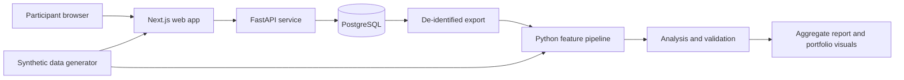

# The Disclosure Gap — Implementation Plan

## Project summary

Build a research-oriented software system that explores whether the gap between **wanting to share something personal** and **actually sharing it** is associated with social anxiety among people ages 18–22. A small web application collects opt-in, structured check-ins; a reproducible Python pipeline engineers relationship-specific features and tests a preregistered hypothesis. The public portfolio demo uses synthetic data. The project does **not** diagnose individuals or infer that choosing privacy is unhealthy.

**Research question:** After accounting for baseline social anxiety, does a greater intention–action gap over four weeks associate with a higher social anxiety score at follow-up?

**Primary outcome:** Follow-up score on a validated social anxiety measure, analyzed as a continuous score. The Mini-SPIN is a possible short measure with adolescent validation; confirm its permitted use and suitability for repeated measurement before implementation. Keep the outcome questionnaire separate from predictor questions to reduce circularity.

**Primary feature:** Proportion of check-ins where a participant wanted to share a personal concern with someone they identified as trusted, but chose not to. This is a behavioral report, not a clinical symptom.

## Scope and research design

1. Enroll adults ages 18–22 who explicitly consent. Start with synthetic data and internal usability testing. Review any university or institutional research requirements before recruiting real participants, especially if the work will be presented as human-subjects research.
2. At baseline, collect age band, optional contextual variables, the validated social anxiety measure, and structured questions about perceived support and sharing comfort. Avoid names, message contents, contacts, exact locations, and social-media account access.
3. Collect one short check-in per week for four weeks. Ask whether the participant wanted to discuss a personal concern, with whom (friend, family, partner, other trusted person, or no one), whether they did so, comfort level, and whether anticipated judgment was a reason for holding back. Include “not applicable,” “prefer not to answer,” and “I chose to keep it private” options.
4. Repeat the social anxiety measure at follow-up. The web app shows only the participant's own descriptive trends, with neutral language. It does not display a diagnostic label, predicted risk, or treatment advice.
5. Analyze aggregate, de-identified data. Record the hypothesis, feature definitions, exclusion rules, and evaluation plan before inspecting outcomes. Treat results as exploratory if recruitment or sample size cannot support the planned analysis.

**Important interpretation:** Lower disclosure can reflect healthy boundaries, unsafe relationships, culture, or a simple preference for privacy. The study tests association, not causation or the ability to detect undisclosed illness. A short convenience sample will not represent all 18–22-year-olds. Extending to ages 14–17 would require a separate consent, privacy, and research protocol.

## Feature engineering

Define features in versioned Python code, not ad hoc notebook cells. Calculate them only from check-ins that occur **before** the follow-up outcome.

| Feature | Proposed calculation | Reason to study it |
| --- | --- | --- |
| Intention–action gap | Weeks with `wanted_to_share = true` and `shared = false` divided by weeks with `wanted_to_share = true` | Captures the mismatch at the center of the hypothesis. |
| Audience asymmetry | Difference in mean comfort ratings for friends versus family, when both are observed | Tests whether comfort depends on the relationship. |
| Topic sensitivity gap | Difference between comfort discussing everyday issues and personal insecurity | Separates general sociability from vulnerable disclosure. |
| Anticipated judgment rate | Fraction of relevant check-ins citing fear of judgment | Tests a proposed mechanism; examine overlap with social anxiety questionnaire items. |
| Support mismatch | Wanted support despite reporting low confidence in a trusted person's response | Distinguishes lack of opportunity from reluctance to approach someone. |
| Within-person variability | Variation in comfort across weeks | Explores whether comfort is stable or context dependent. |

Do not score a person for merely choosing not to share. Preserve missingness and “prefer not to answer” separately from a zero value. Define a minimum number of completed check-ins for longitudinal features and report attrition.

## Analysis and validation

- **Descriptive analysis:** completion and missingness rates, feature distributions, and relationship-specific patterns. Review whether questions are understood as intended through a small usability pilot.
- **Primary statistical model:** regression of follow-up social anxiety score on the intention–action gap, adjusting for baseline score and prespecified context variables. Report effect size and uncertainty interval, not just a p-value.
- **Incremental value:** compare a baseline-only model with one that adds engineered features. Use participant-level train/test splits or cross-validation; never split one participant's check-ins across training and test sets.
- **Leakage audit:** identify predictor questions that effectively reword outcome items, remove them in a sensitivity analysis, and report how results change.
- **Robustness:** examine missing-data assumptions, attrition, feature stability, calibration if making predictions, and performance by available demographic groups where sample sizes permit. Do not publish small-cell subgroup results that could expose participants.
- **Negative result:** if engineered features add little value, report that clearly. The pipeline and careful evaluation remain the engineering contribution.

Machine learning is optional. Start with transparent regression; add regularized models only if the dataset is large enough to justify them. Avoid claiming population-level or clinical performance from a small convenience sample.

## Architecture



The public demo and research environment are separate. Public visitors interact with synthetic records; real participant records are never bundled into the frontend or committed to the repository. The API exposes only the check-in and self-view endpoints needed by participants. Research exports are generated through a restricted, manual workflow.

### Suggested repository layout

```text
apps/web/              Next.js participant flow and synthetic demo
apps/api/              FastAPI endpoints, validation, persistence
packages/contracts/    Versioned survey schema and feature definitions
research/              ETL, feature engineering, analysis, reports
infra/                 Docker Compose and deployment configuration
docs/                  Protocol, data dictionary, consent, model card
tests/                 API, feature, and critical user-flow tests
```

### Data model

- `participants`: random ID, age eligibility result, creation time, withdrawal state; no name or email.
- `consent_events`: consent version, timestamp, agreement or withdrawal action.
- `assessments`: participant ID, baseline/follow-up type, instrument version, item responses, completion time.
- `check_ins`: participant ID, week, structured disclosure responses, completion time.
- `study_events`: limited operational events needed to debug failed submissions, without sensitive response text.

Use a random recovery code or secure session token so participants can return without supplying contact information. Store only a hash of the recovery code. Provide a participant-facing delete/withdraw flow and a documented retention schedule. Use HTTPS, least-privilege database credentials, encryption at rest where supported, and restricted export access. Do not collect free-text disclosures in the first version.

## Technical stack

| Layer | Choice | Purpose |
| --- | --- | --- |
| Frontend | TypeScript, React, Next.js, Tailwind CSS | Accessible consent, check-in, and personal trend screens; synthetic public demo. |
| API | Python, FastAPI, Pydantic | Typed endpoints and survey response validation. |
| Persistence | PostgreSQL, SQLAlchemy, Alembic | Relational storage and versioned migrations. |
| Analysis | Python, Polars, DuckDB/Parquet, statsmodels, scikit-learn | Reproducible ETL, features, regression, and optional predictive comparisons. |
| Visualization | Altair or matplotlib | Aggregate research figures and portfolio charts. |
| Quality | pytest, Playwright, Ruff, ESLint, GitHub Actions | Feature tests, core flow checks, linting, and CI. |
| Local environment | Docker Compose | Run web app, API, and database together. |
| Deployment | Managed frontend/API/database services, chosen after privacy review | Host the synthetic portfolio demo first; deploy real data collection only after research and security review. |

Pin dependency versions when implementation begins. Keep secrets in deployment secret stores and example environment files free of real credentials.

## API outline

- `POST /v1/participants`: age-eligibility and consent flow; returns an opaque session.
- `POST /v1/assessments`: submit baseline or follow-up measure once per scheduled window.
- `POST /v1/check-ins`: submit a structured weekly check-in.
- `GET /v1/me/trends`: return only the participant's own descriptive summaries.
- `DELETE /v1/me`: withdraw and delete participant data according to the consent policy.

Version the survey contract and reject invalid or duplicate submissions. Keep an auditable mapping from raw questions to engineered features.

## Milestones and definition of done

1. **Protocol and mock data:** write the hypothesis, exact questions, data dictionary, consent text, threat model, and synthetic-data generator. Done when a synthetic participant can complete all study weeks.
2. **Vertical slice:** implement consent, baseline, one check-in, follow-up, personal trends, persistence, and deletion. Done when the complete flow passes an end-to-end test and works with keyboard navigation.
3. **Research pipeline:** export de-identified data; implement features and baseline regression; generate a reproducible report. Done when one command rebuilds all tables and figures from an input export.
4. **Validation:** run leakage and missingness checks, participant-level evaluation, sensitivity analyses, and documentation. Done when the report states limitations and can reproduce its results from a fresh environment.
5. **Pilot and portfolio:** conduct a small adult usability pilot after required reviews, revise confusing questions, and publish the synthetic demo plus methods and findings. Do not claim a social anxiety association until supported by actual results.

## Background sources

- [Pew Research Center: teens' comfort discussing mental health differs by audience](https://www.pewresearch.org/internet/2025/04/22/teens-social-media-and-mental-health/)
- [Study of disclosure and service use in socially anxious adolescents](https://pmc.ncbi.nlm.nih.gov/articles/PMC3763858/)
- [Mini-SPIN validation in adolescents](https://pubmed.ncbi.nlm.nih.gov/21944882/)
- [UNICEF guidance on ethical research involving children](https://www.unicef.org/innocenti/reports/ethical-research-involving-children)
