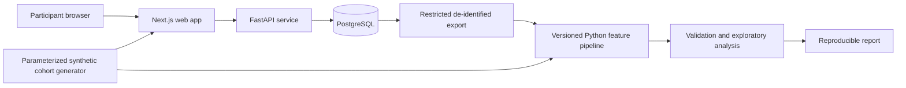

# The Disclosure Gap — Privacy-First Longitudinal Research Platform

## Project intent

This project begins with a question I find personally meaningful: what can be learned from the moments when someone wants support from a trusted person but decides not to ask for it?

I am not presenting that question as a new psychological breakthrough. Social anxiety, avoidance, self-disclosure, and help-seeking already have substantial research literatures. My ambition is to use this domain as a demanding case study for building thoughtful software: a longitudinal data-collection system that treats sensitive information carefully, makes its assumptions explicit, and produces reproducible analysis.

The primary contribution is therefore the engineering system—not a claim that the software discovers, diagnoses, or predicts social anxiety. A public portfolio version will use synthetic data. Any work with real participants will require the appropriate institutional review and will be described as a limited, exploratory pilot unless its design and sample justify stronger conclusions.

### Central engineering objective

Build a privacy-conscious platform that can:

- collect versioned baseline, repeated check-in, and follow-up responses;
- enforce temporal and data-integrity rules across a multi-week study;
- support consent, withdrawal, and deletion as real product workflows;
- export de-identified data through a restricted and auditable path;
- transform raw records into documented, testable features; and
- reproduce tables and figures from a clean environment with one command.

### Case-study question

As a demonstration of the platform, explore whether a four-week intention–action gap—wanting to share a personal concern with a trusted person but choosing not to—is associated with follow-up social-anxiety scores after accounting for baseline scores.

This is an exploratory association, not a causal or diagnostic claim. A negative, uncertain, or uninformative result is acceptable; the project succeeds when the system handles the data and analysis honestly.

## Portfolio positioning

The project should demonstrate that I can translate an ambiguous, sensitive real-world problem into a reliable software and data system. The strongest evidence will be working behavior: schema evolution, idempotent submissions, access boundaries, safe deletion, deterministic synthetic cohorts, reproducible exports, and automated tests.

The project should not be presented as:

- a novel theory of social anxiety;
- a clinical screening or treatment product;
- proof that choosing privacy is unhealthy;
- a machine-learning system that can infer undisclosed feelings; or
- a population-level study when only synthetic or convenience-sample data is available.

## Case-study design

1. Begin with synthetic cohorts and internal usability testing. Synthetic records should include controlled effect sizes, missing responses, attrition, sparse denominators, duplicate submissions, and survey-version changes.
2. Model adults ages 18–22 completing a baseline assessment, one short check-in per week for four weeks, and a follow-up assessment.
3. At each check-in, record structured responses about whether the participant wanted to discuss a concern, the type of trusted relationship involved, whether sharing occurred, comfort, and optional reasons for holding back. Do not collect message contents, names, contacts, exact locations, or social-media data.
4. Keep “not applicable,” “prefer not to answer,” “I chose to keep it private,” and missing responses distinct. Lower disclosure can reflect healthy boundaries, unsafe relationships, culture, or preference—not pathology.
5. If a real usability pilot is pursued, review university or institutional requirements before recruitment. Do not publish an association claim unless the study design, sample size, and review process support it.

### Case-study measures

**Outcome:** Follow-up score on the APA DSM-5-TR Severity Measure for Social Anxiety Disorder—Adult, treated as a continuous 0–40 raw or prorated score. Keep the outcome instrument separate from predictor questions and preserve its version and scoring rules.

**Primary feature:** Among eligible check-ins, the proportion where `wanted_to_share = true` and `shared = false`. Treat this as a self-reported behavioral summary, not a clinical symptom.

The feature contract must specify behavior when the denominator is zero, the minimum number of eligible observations, and the distinction between a valid zero and missing or insufficient data.

## Engineering contributions

| Area | What the project should demonstrate |
| --- | --- |
| Versioned contracts | Survey schemas, instrument versions, migrations, and an auditable mapping from raw fields to derived features. |
| Temporal integrity | Valid assessment windows, prevention of future-data leakage, duplicate handling, and participant-level boundaries. |
| Privacy lifecycle | Data minimization, opaque participant sessions, hashed recovery codes, consent history, withdrawal, and verified deletion. |
| Reproducible data pipeline | A deterministic path from PostgreSQL export to Parquet/DuckDB, engineered features, model outputs, tables, and figures. |
| Synthetic validation | Cohorts with known parameters that test whether the pipeline recovers expected patterns and survives missingness and attrition. |
| Operational safety | Least-privilege access, restricted exports, secret management, and useful logs that contain no sensitive response content. |
| Software quality | Unit, contract, migration, integration, accessibility, and end-to-end tests running in CI. |

## Feature pipeline

Define features in versioned Python modules rather than ad hoc notebook cells. Calculate them only from check-ins that precede the follow-up outcome.

| Feature | Proposed calculation | Engineering or analytical purpose |
| --- | --- | --- |
| Intention–action gap | Non-sharing events divided by eligible wanted-to-share events | Exercises sparse denominators, eligibility rules, and missingness. |
| Audience asymmetry | Difference in mean comfort for friends versus family when both are observed | Exercises grouped longitudinal features and insufficient-data handling. |
| Topic sensitivity gap | Difference between comfort with everyday issues and personal insecurity | Tests versioned item-to-feature mappings. |
| Anticipated judgment rate | Fraction of eligible check-ins citing fear of judgment | Supports an explicit leakage and construct-overlap audit. |
| Support mismatch | Wanted support while reporting low confidence in the likely response | Demonstrates a multi-field derived feature with documented assumptions. |
| Within-person variability | Variation in comfort across eligible weeks | Exercises repeated-measures logic; omit when observations are insufficient. |

Every feature should have fixtures for normal, boundary, missing, and invalid cases. The generated data dictionary should state its formula, inputs, version, eligibility rules, and known limitations.

## Analysis and validation

### Pipeline validation with synthetic data

- Generate cohorts from explicit seeds and parameters.
- Include null, weak-effect, and confounded scenarios rather than only data that confirms the case-study hypothesis.
- Verify row counts, participant isolation, feature values, missingness flags, and exclusion reasons at every stage.
- Test that changing a survey or feature version does not silently alter previously versioned results.
- Rebuild the complete report from a fresh environment with one command.

### Optional exploratory analysis with real data

- Preregister the hypothesis, primary feature, exclusions, covariates, and analysis before inspecting outcomes.
- Use a transparent regression of follow-up score on the gap feature while adjusting for baseline score and a small set of justified covariates.
- Report effect sizes and uncertainty intervals, not only p-values.
- Run sensitivity analyses for sparse denominators, attrition, missingness, and predictor questions that overlap with outcome items.
- Keep confirmatory inference separate from optional predictive evaluation. Do not use train/test comparisons unless the participant count can support them.
- State clearly when the sample is too small to answer the question.

Four weekly observations provide only a coarse case study. Relationship-specific comparisons and within-person variability may often be unavailable; the system should surface that limitation rather than manufacture a score.

## Architecture



The public demo and any real research environment are separate. Public visitors interact only with synthetic records. Real participant records are never bundled into the frontend, committed to the repository, or exposed through portfolio endpoints.

### Repository layout

```text
apps/web/              Next.js participant flow and synthetic demo
apps/api/              FastAPI endpoints, validation, and persistence
packages/contracts/    Versioned survey and API contracts
research/              Synthetic generation, ETL, features, analysis, reports
infra/                 Docker Compose and deployment configuration
docs/                  Data dictionary, threat model, protocol, and model card
tests/                 Contract, migration, API, feature, and user-flow tests
```

### Core data model

- `participants`: random ID, eligibility result, creation time, and withdrawal state; no name or email.
- `consent_events`: consent version, timestamp, and agreement or withdrawal action.
- `assessments`: participant ID, baseline/follow-up type, instrument version, item responses, and completion time.
- `check_ins`: participant ID, study week, contract version, structured responses, and completion time.
- `study_events`: minimal operational events required to investigate failures, without sensitive response text.
- `exports`: export version, creation metadata, schema fingerprint, and audit information; no downloadable public endpoint.

Use a random recovery code or secure session token so participants can return without providing contact information. Store only a hash of a recovery code. Use HTTPS, least-privilege database credentials, deployment secret stores, and a documented retention policy.

## API outline

- `POST /v1/participants`: perform eligibility and consent flow; return an opaque session.
- `POST /v1/assessments`: accept one valid baseline or follow-up submission per configured window.
- `POST /v1/check-ins`: accept an idempotent, versioned weekly check-in.
- `GET /v1/me/trends`: return only the participant’s own neutral descriptive summaries.
- `DELETE /v1/me`: withdraw and delete or tombstone data according to the documented policy.

Reject invalid versions, impossible state transitions, unauthorized access, and duplicate submissions. Test those behaviors directly.

## Milestones and definition of done

1. **Contracts and synthetic cohorts:** define versioned questions, database constraints, feature rules, and a parameterized generator. Done when seeded cohorts cover null, effect, missingness, attrition, and schema-change scenarios.
2. **Tested vertical slice:** implement consent, baseline, check-ins, follow-up, personal trends, persistence, and withdrawal. Done when the flow passes API and browser tests, including keyboard navigation and duplicate-submission cases.
3. **Privacy lifecycle:** implement recovery, authorization boundaries, restricted exports, logging rules, and deletion verification. Done when tests prove one participant cannot access another’s data and withdrawal produces the documented result.
4. **Reproducible pipeline:** implement export, validation, feature engineering, exploratory regression, and report generation. Done when one command rebuilds all artifacts from a clean environment and the synthetic scenarios behave as expected.
5. **Portfolio release:** deploy the synthetic demo and publish concise architecture, threat-model, and reproducibility documentation. Done when a reviewer can run the system, understand its tradeoffs, and verify the main engineering claims.
6. **Optional pilot:** pursue a small adult usability or research pilot only after the appropriate review. Report it modestly and separately from the engineering accomplishment.

## Background sources

- [APA DSM-5-TR Severity Measure for Social Anxiety Disorder—Adult](https://www.psychiatry.org/File%20Library/Psychiatrists/Practice/DSM/DSM-5-TR/APA-DSM5TR-SeverityMeasureForSocialAnxietyDisorderAdult.pdf)
- [Development and initial validation of the DSM-5 dimensional anxiety scales](https://pubmed.ncbi.nlm.nih.gov/23148016/)
- [Community-sample psychometrics for the DSM-5 dimensional anxiety scales](https://pmc.ncbi.nlm.nih.gov/articles/PMC6877262/)
- [Social context and the real-world consequences of social anxiety](https://pmc.ncbi.nlm.nih.gov/articles/PMC7028452/)
- [Self-disclosure and mental health service use in socially anxious adolescents](https://pmc.ncbi.nlm.nih.gov/articles/PMC3763858/)
- [Effects of safety-behavior fading on social anxiety and emotional disclosure](https://pubmed.ncbi.nlm.nih.gov/36029642/)
- [Systematic review of self-disclosure interventions for adolescents and young adults](https://pubmed.ncbi.nlm.nih.gov/36738384/)
